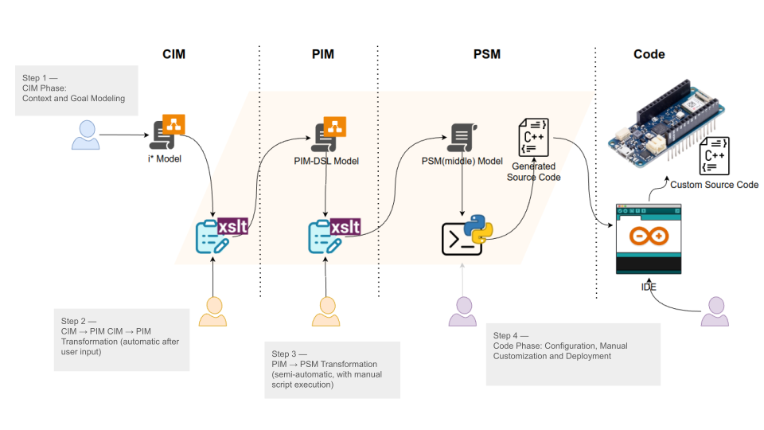
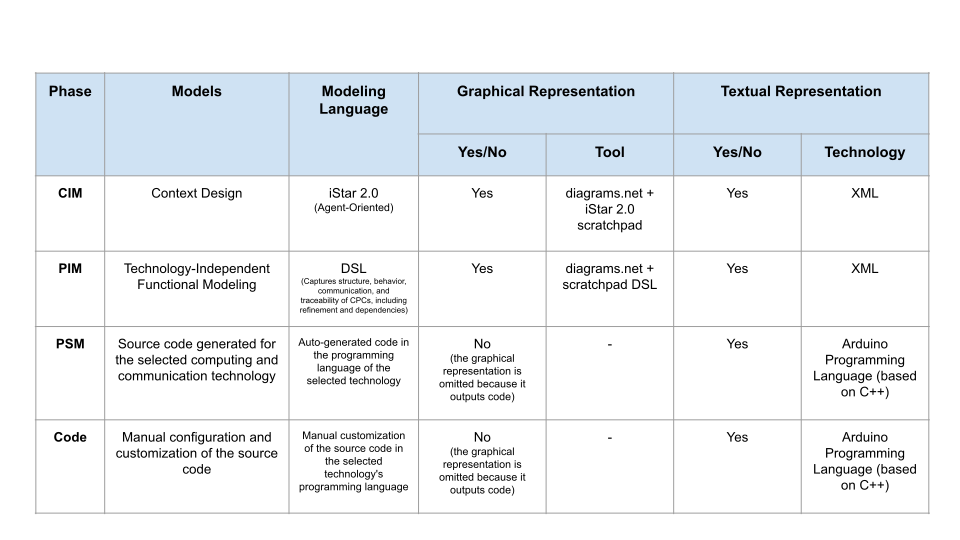
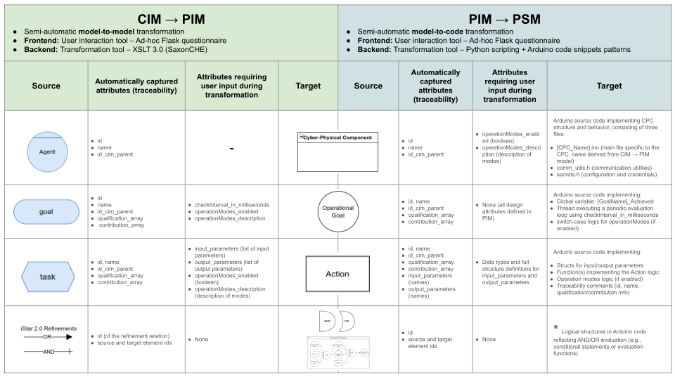
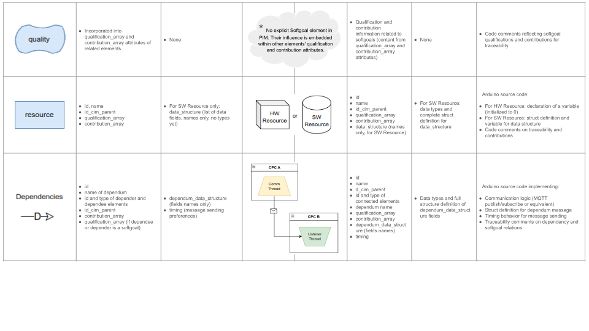
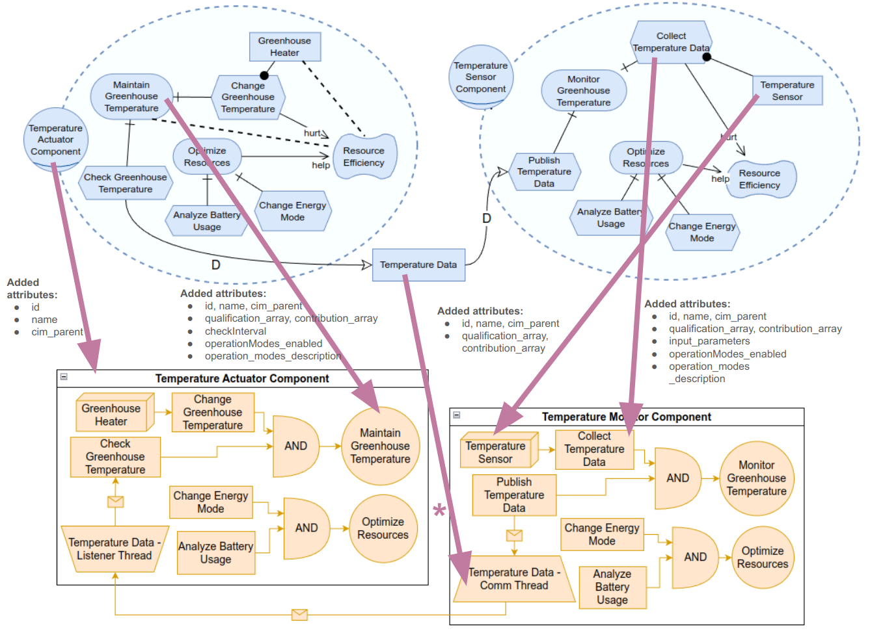
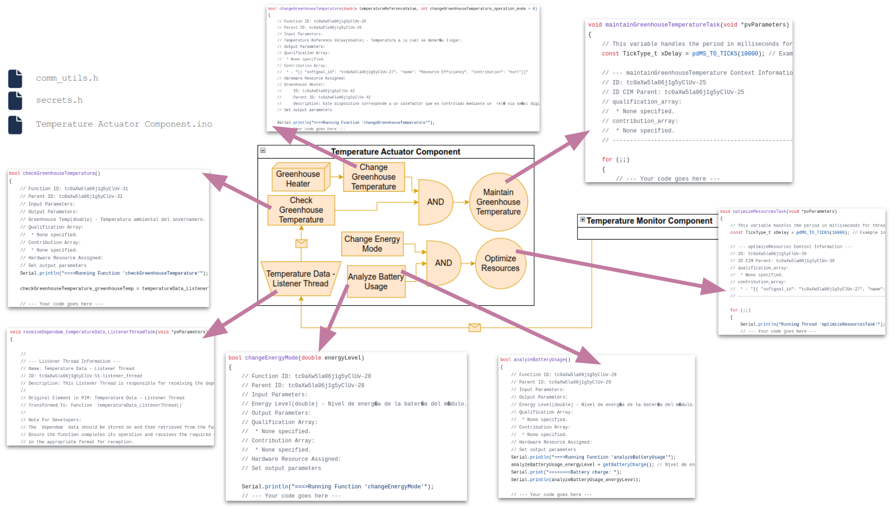
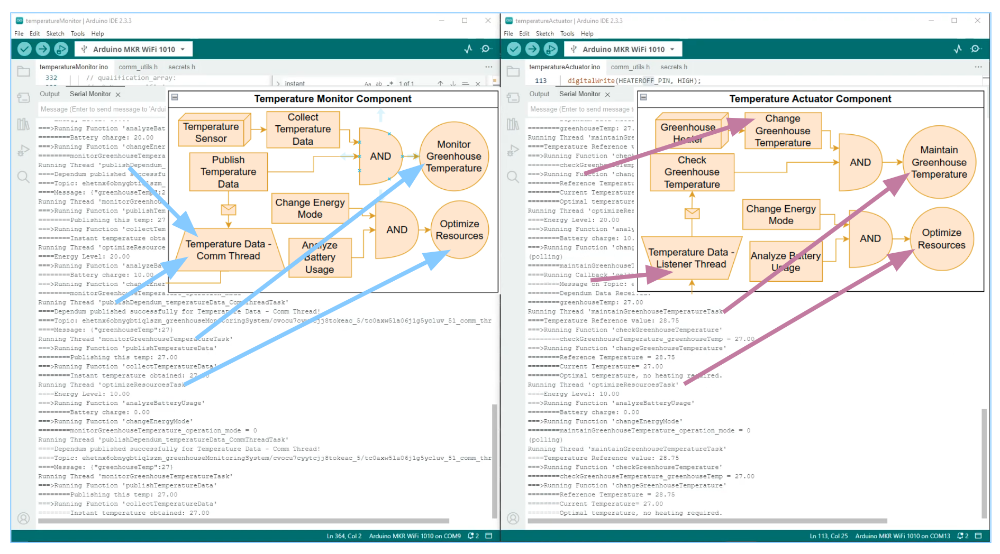

# Overview of the Agent-Oriented MDD Process for CPS Development
The figure below provides an overview of the agent-oriented Model-Driven Development (MDD) process applied to Cyber-Physical System (CPS) development. It illustrates the four main phases—CIM, PIM, PSM, and Code—highlighting the tools used, transformation flow, and designer interactions at each step.

### Step 1 — CIM Phase: Context and Goal Modeling

The designer defines the CPS context and goals using the iStar 2.0 library within diagrams.net, producing a CIM model that captures the system’s intentions and agent interactions.

---

### Step 2 — CIM → PIM Transformation (automated post-input)

The designer launches the transformation through a web interface. A Flask-based frontend prompts the user with a questionnaire to gather technology-independent design details. Once the input is submitted, the backend (powered by XSLT) automatically generates the PIM model, using a DSL that describes functional, structural, and behavioral aspects of the CPS.

---

### Step 3 — PIM → PSM Transformation (requires script execution)

Optionally, the PIM model may be refined using diagrams.net with the DSL library. Then, the designer completes a second web questionnaire to capture platform-specific information. This input is used to generate an intermediate PSM model. At this point, the designer manually executes a Python script to transform the PSM model into platform-specific source code. While this step is simple, it is not yet fully automated.

---

### Step 4 — Code Phase: Configuration, Manual Customization and Deployment

The generated source code is adapted to the deployment environment in three steps. First, configuration parameters such as WiFi credentials and hardware pin assignments are set. Then, manual customization may be required—for example, adding logic to support specific operation modes. Finally, the adjusted code is deployed to the target hardware (e.g., Arduino MKR WiFi 1010) using the Arduino IDE, completing the development cycle.

# Technologies and Tools per Modeling Phase
The following table summarizes the technologies and tools used across each modeling phase of the proposed MDD process. It highlights the type of models, languages, and the availability of graphical and textual representations at each stage.

# Summary of Transformations (CIM → PIM → PSM): Attributes Mapping

The following table summarizes how design attributes are handled throughout the transformation process from CIM to PIM to PSM. For each construct, it shows which attributes are automatically captured (e.g., for traceability) and which require user input during transformation. It also highlights the final target representation, such as code artifacts in the PSM stage.

> **Note:**
> - *Before executing the PIM → PSM transformation, users may manually edit the PIM model (e.g., to adjust operation modes) using diagrams.net. However, no additional user input is required during the automatic transformation process.*
> - *In the PSM phase, logical operations (AND/OR refinements) evaluate global boolean variables. Each structure—whether threads (Operational Goals) or functions (Actions)—updates its corresponding variable to indicate fulfillment status. The refinement logic combines these variables to determine the achievement of the parent element.*
> - *Softgoals are not transformed as independent constructs in PIM. Instead, their influence is subsumed into related elements' attributes. This information is carried over to the PSM phase and incorporated as code comments to preserve traceability of quality concerns and contributions.*
> - *The dependum element present in the CIM phase does not appear as an independent construct in the PIM and PSM phases. Instead, its data and behavior are subsumed into the Comm Thread and Comm Listener elements in PIM, and later materialized as a struct definition and communication logic in the generated source code.*

# Illustrating Transformation and Attribute Propagation in the CIM → PIM Phase
To demonstrate the feasibility of this process, a basic CPS was implemented for greenhouse management. During the transformation from CIM to PIM, each construct receives additional attributes to ensure traceability, enhance functional details, and support later code generation. Specifically:

- Agents are transformed into Cyber-Physical Components (CPCs) with added identifiers.
- Goals and Tasks acquire attributes capturing their parent element, qualification and contribution relations, operation modes, and evaluation parameters.
- Dependencies are transformed into communication constructs with attributes defining the message structure, timing behavior, and traceability. These added attributes ensure that all key design information is preserved and made explicit for subsequent phases.

These added attributes not only enrich functional details but also permit traceability from CIM to PIM and subsequent phases.

> **Note:**
> * *An iStar 2.0 dependency relation is transformed into a communication process in the PIM phase, involving:*
>   - Comm Thread (in CPC dependee)
>   - Comm Listener (in CPC depender)
>   - Comm Relations (links between elements)
>
> * *Main added attributes to PIM constructs for dependency transformation:*
>   - `id`, `name`, `cim_parent`
>   - `dependum_data_structure`
>   - `checkInterval_in_milliseconds`
>   - `operationModes`

# Illustrating Code Generation in the PSM Phase

The following diagram illustrates the mapping between PIM constructs and the corresponding code segments generated during the PSM phase. Although the image does not delve into implementation details, it highlights how each construct in the model is transformed into source code.

# Illustrating Successful Execution of Generated and Customized Code on Arduino Hardware

This image shows the execution of the generated and customized source code on Arduino hardware. It maps debug output lines to the corresponding PIM constructs, evidencing the runtime behavior of each generated structure. The goal is to illustrate that the generated code operates as expected on the target platform, validating the basic feasibility of the model-driven approach.

