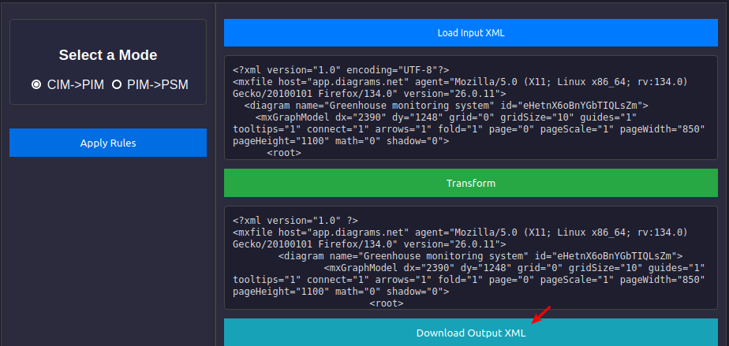

# MDD4CPS
A tool designed to implement Model-Driven Development (MDD) for Cyber-Physical Systems (CPS), enabling automated model transformation, and code generation to streamline CPS development. For more details, see the [process overview documentation](MDD4CPS_process_overview.md).

## Installation

1. **Clone the Repository**  
   ```bash
   git clone https://github.com/LD-111/MDD4CPS.git
   cd MDD4CPS/src/
   ```
2. **Build and start the container using Docker Compose:**  
   ```bash
   docker-compose up --build
   ```
This will automatically build the Docker container and start the service. You can now access the tool through the specified ports in the docker-compose.yml file.

## Usage

You can access the tool at [localhost:5000](http://localhost:5000) after running the Docker container.

### CIM to PIM Transformation (Default Mode)
<center>
  
</center>

1. **Create Your iStar Model**:
   - First, create the iStar model of your CPS using the provided **diagrams.net scratchpad**. This scratchpad is designed specifically for creating **Computation Independent Models (CIM)** based on the iStar notation.

2. **Load your iStar model**:
   - Once the iStar model is ready, click the **"Load Input XML"** button to upload your model (in XML format) into the tool.
<center>
  
</center>

3. **Apply Rules**:
   - After loading the model, click the **"Apply Rules"** button. This will trigger a form asking for user parameters relevant to the transformation, such as task input parameters, timing for Goals, etc.
<center>
  
</center>

4. **Submit the Form**:
   - Fill out the form with the necessary parameters and submit it to proceed with the transformation.
<center>
  
</center>

5. **Transform the Model**:
   - After submitting the form, click the **"Transform"** button to generate the diagrams.net compatible **Platform Independent Model (PIM)**.
<center>
  
</center>

6. **Download the Output**:
   - Once the transformation is complete, click the **"Download Output XML"** button to download the resulting PIM model.
<center>
  
</center>

### PIM to PSM Transformation
<center>
  
</center>

1. **Change Mode**:
   - Select the appropriate **"PIM->PSM"** mode.
<center>
  
</center>

2. **Upload Your PIM Model**:
   - Upload the PIM model generated in the previous phase by clicking the **"Load Input XML"** button.

3. **Select Platform and Communication Technology**:
   - Choose the **Platform** and **Communication Technology** from the dropdown menu. The available options are:
     - **MQTT** (work in progress, not fully implemented yet)
     - **Arduino** (work in progress, not fully implemented yet)
<center>
  
</center>

4. **Apply Rules**:
   - Click the **"Apply Rules"** button. This will bring up a form where you can enter additional parameters for the transformation.

5. **Submit the Form**:
   - Fill out the form with the required information and submit it to proceed with the transformation.

6. **Transform the Model**:
   - After submitting the form, click the **"Transform"** button to generate a non-diagrams.net compatible **intermediate model**.
   - Note: The PIM to PSM transformation is **not fully automated** in this version. The intermediate model is generated, but the source source code is not generated automatically from it.**.

7. **Transform to Source Code (Manual Step)**:
   - To convert the intermediate model into source code, navigate to the **backend folder** and run the respective Python script with the following command:
     ```bash
     python psm_to_code-arduinomkr1010.py "/path/to/intermediate_model.xml"
     ```
   - This will generate a folder containing the source code for each node in the model, which can be used for further development, now it's up to you to develop the custom source code from the generated structures.


## License

This project is made available for non-commercial use under a license based on  
[Creative Commons Attribution-NonCommercial 4.0 International (CC BY-NC 4.0)](https://creativecommons.org/licenses/by-nc/4.0/).

For full license terms and third-party software notices, see the [LICENSE](LICENSE) file.


